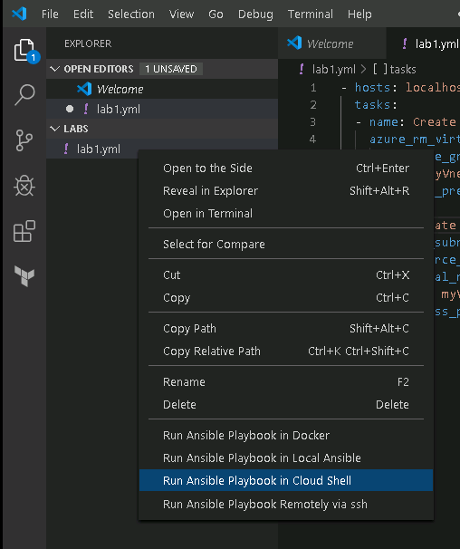

# Ansible Lab 1 - Basic Usage and Typical Workflow

In this section you will:

- Create a virtual network (VNet)
- Create a subnet within the VNet

## How to start

Create a folder on the lab virtual machine where you will save all your Ansible playbooks.

We recommend using VS Code for creating playbooks and running your playbook in Cloud Shell in this lab.

[Ansible](https://marketplace.visualstudio.com/items?itemName=vscoss.vscode-ansible) and [Azure account](https://marketplace.visualstudio.com/items?itemName=ms-vscode.azure-account) extensions are required and already installed in your VS Code environment. The [Ansible extension overview](https://marketplace.visualstudio.com/items?itemName=vscoss.vscode-ansible) provides good guidance on what you need to do to get started. On a high level:

- associate your YAML files with `ansible` language in VSCode `settings.json`:

```json
    "files.associations": {
        "**/*.yml": "ansible"
    },
```

- To run playbook in Cloud Shell simply click your *.yml file; right click and then select `Run your playbook in Cloud Shell`
- If you have not logged in, the Azure Account extension will prompt you to sign in.
- File is copied to the `clouddrive` folder in Cloud Shell upon saving so you don't need to explicitly copy file to Cloud Shell unless otherwise stated in the lab.

## Create a resource group

A resource group is a logical container in which Azure resources are deployed and managed. Use the [azure_rm_resourcegroup](https://docs.ansible.com/ansible/latest/modules/azure_rm_resourcegroup_module.html) module to create a resource group.

```yml
  - name: Create a resource group
    azure_rm_resourcegroup:
      name: myResource_group
      location: myLocation
```

When all resources created in this workshop are no longer needed, you can easily delete them by running the following playbook:

```yml
- hosts: localhost
  tasks:
    - name: Delete a resource group
      azure_rm_resourcegroup:
        name: myResource_group
        force_delete_nonempty: yes
        state: absent
```

> **NOTE:** This step is included for completeness. **You can skip this step** since you cannot create resource group in this workshop. Please use the second empty regroup group IoC-02-XXXXXX for all labs.

## Create a virtual network(VNet)

A virtual network is a virtual, isolated portion of the Azure public network. Each virtual network is dedicated to your subscription. Create one that uses "172.16.0.0/16" as address prefix.

1. Create a new .yml file.
2. Use `Hosts: localhost` in the header. Control node is the node Ansible is installed on. The hosts parameter is what the playbook will be executed on. `Hosts: localhost` means the playbook is executed on the localhost only. Your playbook should have this format:

```yaml
- hosts: localhost
  tasks:
  - name: ...
    ...
  - name: ...
    ...
```

3. Use spaces. **Not** tab.
4. Use the [azure_rm_virtualnetwork](https://docs.ansible.com/ansible/latest/modules/azure_rm_virtualnetwork_module.html) to complete this step.
5. Name your task appropriately so that you know precisely which step fails if Ansible runs into an issue.
6. Run your playbook by right clicking your .yml file and select **Run Ansible Playbook in Cloud Shell**

    

#### Cheat Sheet: VNET
<details>
<summary>
Expand to see how you can create a VNet
</summary>

```yaml
  - name: Create a virtual network. 
    azure_rm_virtualnetwork:
      resource_group: myResource_group
      name: myVnet
      address_prefixes: "172.16.0.0/16"
```

</details>

> **NOTE:** The `gather_facts` module is automatically called by playbooks to gather useful variables about remote hosts that can be used in playbooks. You can disable gathering facts by including `gather_facts: no` in the header. You may also get warnings like below. This is because you have no inventory.

```bash
pui@Azure:~$ ansible-playbook ./clouddrive/ansible-playbooks/lab1.yml
 [WARNING]: No inventory was parsed, only implicit localhost is available

 [WARNING]: provided hosts list is empty, only localhost is available. Note that the implicit localhost does not match 'all'


PLAY [localhost] **************************************************************************************************

TASK [Gathering Facts] ********************************************************************************************
ok: [localhost]

TASK [Create a virtual network.] **********************************************************************************
changed: [localhost]

PLAY RECAP ********************************************************************************************************
localhost                  : ok=2    changed=1    unreachable=0    failed=0    skipped=0    rescued=0    ignored=0  
```

## Create a subnet within the VNet

Subnets enable you to segment the virtual network into one or more sub-networks and allocate a portion of the virtual network's address space to each subnet. Add to existing playbook, subnet "172.16.10.0/24".

1. Add as the next task to your existing playbook and use [azure_rm_subnet](https://docs.ansible.com/ansible/latest/modules/azure_rm_subnet_module.html) module to create the subnet.
2. Run your playbook in Cloud Shell again. All Azure modules (except azure_rm_deployment) are implemented to support idempotency. Since you didn't change anything in previous task and the virtual already exists, all three (three because of the 1st "Gathering Facts" task) are `ok`; only one changed is made.

#### Cheat Sheet: subnet
<details>
<summary>
Expand to see how you can create a subnet
</summary>

```yaml
  - name: Create a subnet within the virtual network
    azure_rm_subnet:
        resource_group: myResource_group
        virtual_network_name: myVnet
        name: myVnetSubnet
        address_prefix_cidr:  "172.16.10.0/24"
```

</details>

```bash
PLAY [localhost] ********************************************************************************************************

TASK [Gathering Facts] **************************************************************************************************
ok: [localhost]

TASK [Create a virtual network.] ****************************************************************************************
ok: [localhost]

TASK [Create a subnet within the virtual network] ***********************************************************************
changed: [localhost]

PLAY RECAP **************************************************************************************************************
localhost                  : ok=3    changed=1    unreachable=0    failed=0    skipped=0    rescued=0    ignored=0 

```

## How to verify

Congratulations, you have created your first playbook. Go to [Azure portal](https://portal.azure.com) to verify that you have created the resources.

> **CODE**: You can refer to [lab1.yml](Code/lab1.yml) for a complete sample playbook.

## Further readings

- [Azure Ansible Dev Hub](https://docs.microsoft.com/en-us/azure/ansible/) - to learn everything about Ansible + Azure
    - Use the [Ansible Azure Marketplace](https://aka.ms/ansibleaz) solution template if you want to spin up a control node in Azure. This solution template installs Ansible on a CentOS 7.5 Linux VM with tools configured to work with Azure. You can refer to this [Quickstart](https://docs.microsoft.com/en-us/azure/ansible/ansible-deploy-solution-template).
    - Refer to [Ansible module support matrix](https://aka.ms/ansiblesupport) for a complete list of Azure modules.
