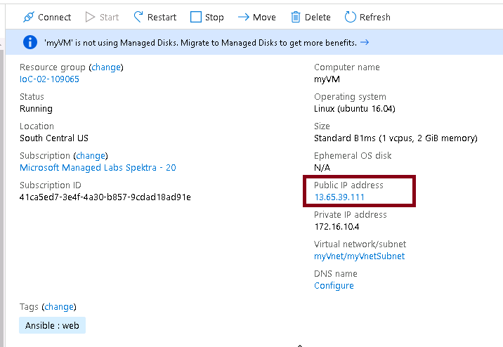

# Ansible Lab 5 - Reusability

In this section you will:

- include a task or list of tasks in your play
- learn how to use Dynamic Inventory
- get an introduction to Ansible roles

## Before you start

As mentioned in previous lab, the VS Code Ansible extension provides better integration experience when you need to work with multiple files so we recommend running Ansible in the remote host via SSH. You can hit `F1` to copy files to remote host.

1. Hit `F1`; type "Ansible: copy folder to Remote Host"
1. Follow the prompt to provide the source directory
1. Select from the list of hosts. (You can refer to instruction in the **Before you start** section in Lab 4 if you have not set up a remote host yet.)
1. Next, specify the target folder. You can keep it the same as your local directory

Run your playbook by right clicking your `.yml` file and select **Run playbook remotely via SSH**.

## Reusing task(s) in your playbook

You can use the [include](https://docs.ansible.com/ansible/latest/modules/include_module.html) and [include_tasks](https://docs.ansible.com/ansible/latest/modules/include_tasks_module.html#include-tasks-module) modules to dynamically include a task or a list of tasks.

Let's modify what you have done so far to create a network of multi-tier applications based on this [Azure CLI sample](https://docs.microsoft.com/en-us/azure/virtual-network/scripts/virtual-network-cli-sample-multi-tier-application).

- a virtual network (172.16.0.0/16) with front-end and back-end subnets
- two virtual machines: web and MySQL; one in each subnet


What you have done so far:
- A VNet 172.16.0.0/16
- A front-end subnet - 172.16.10.0/24 with NSG rules that:
    - allows SSH traffic from the Internet to the front-end subnet on port 22
    - allows HTTP traffic in from the Internet to the front-end subnet on port 80
- And a VM in the front-end subnet that acts as the front-end web server

You need to add:
- A backend subnet 172.16.20/24 with NSG rules that:
  - allows SSH traffic from the Internet to the front-end subnet on port 22
  - allows MySQL traffic from the front-end subnet to the back-end subnet on port 3306
  - blocks all outbound traffic from the back-end subnet to the Internet
- A VM (MySQL) in the back-end subnet.

Let's start by restructuring your playbook and break the tasks out into a few playbooks.

1. Move all common tasks related to network configuration to one YAML file say `configurenetwork.yml` so that you can use the same list of tasks to provision and configure the subnet, public IP etc. networking related tasks.

        ```yml
        - name: Create a subset within the virtual network
          azure_rm_subnet:
            ...
          register: subnet
            
        - name: Create public IP address
          azure_rm_publicipaddress:
            ...
          register: publicIP
        
        - name: Create Network Security Group
          azure_rm_securitygroup:
            ...
          loop: "{{ NSGlist }}"
          register: NSG
        
        - name: Create virtual network interface card(NIC) with public IP
          azure_rm_networkinterface:
            ...
          register: NIC
        ```

      >**Note**: you can register a variable after each task and use "debug" to show the output. By doing so, you can also refer to value in the Azure resource by using e.g., `"{{ NIC.state.name }}"` in subsequent task.

For example:

```yml
- name: Show NIC details
  debug:
    var: NIC
```

### Cheat Sheet: confignetwork.yml

<details>
<summary>
Expand to see confignetwork.yml
</summary>

```yml
- name: Create a subset within the virtual network
  azure_rm_subnet:
    resource_group: "{{ myResource_group }}"
    virtual_network_name: "{{ myVnet }}"
    name: "{{ myVnetSubNet }}"
    address_prefix_cidr:  "{{ subnetAddPrefix }}"
  register: subnet
    
- name: Create public IP address
  azure_rm_publicipaddress:
    resource_group: "{{ myResource_group }}"
    allocation_method: Static
    name: "{{ myPublicIP }}"
  register: publicIP

- name: Create Network Security Group
  azure_rm_securitygroup:
    resource_group: "{{ myResource_group }}"
    name: "{{ myNetworkSecurityGroup}}"
    rules:
      - name: "{{ item.name }}"
        access: "{{ item.access }}"
        protocol: "{{ item.protocol }}"
        destination_port_range: "{{ item.port }}"
        priority: "{{ item.priority }}"
        direction: "{{ item.direction }}"
        source_address_prefix: "{{ item.source_address_prefix }}"
  loop: "{{ NSGlist }}"
  register: NSG

- name: Create virtual network interface card(NIC) with public IP
  azure_rm_networkinterface:
    resource_group: "{{ myResource_group }}"
    name: "{{ myNIC }}"
    virtual_network: "{{ myVnet }}"
    subnet: "{{ myVnetSubNet }}"
    ip_configurations:
      - name: ipconfig
        public_ip_address_name: "{{ myPublicIP }}"
        primary: yes
    security_group: "{{ myNetworkSecurityGroup }}"
  register: NIC
```

</details>

2. Move the task to create the VM to a file called `createvm.yml`. Let's add an additional configuration (a tag) to each VM.

    - For the front-end, add a tag by setting `tags: "Ansible=web"`
    - For the back-end, add a tag by setting `tags: "Ansible=MySQL"`

### Cheat Sheet: createvm.yml

<details>
<summary>
Expand to see createvm.yml
</summary>

```yml
- name: Get latest version of a secret
  azure_rm_keyvaultsecret_info:
    vault_uri: "https://{{ keyvault_name }}.vault.azure.net"
    name: "{{ secret_name }}"
  register: output

- name: Create a virtual machines
  azure_rm_virtualmachine:
    resource_group: "{{ myResource_group }}"
    name: "{{ myVM }}"
    admin_username: "testadmin"
    admin_password: "{{ output.secret.value }}"
    vm_size: Standard_B1ms
    network_interfaces: "{{ NIC.state.name }}"
    image:
      offer: UbuntuServer
      publisher: Canonical
      sku: 16.04-LTS
      version: latest
    tags: "{{ myTags }}"
```

</details>

3. main.yml will be your main playbook. The structure is similar to this:  

```yml
- hosts: localhost
  vars_files:
    - ./vars.yml
    
  tasks:
  - name: Create a resource group
    azure_rm_resourcegroup:
      ...

  - name: Create a virtual network.
    azure_rm_virtualnetwork:
      ...

  - name: Create front-end subnet and NSG rules
    vars:
      ... 
    include_tasks: ./confignetwork.yml

  - name: Create a front-end virtual machines
    vars:
      ...
    include: ./createvm.yml
  
  - name: Create back-end subnet and NSG rules
    vars:
      ...
    include_tasks: ./confignetwork.yml

  - name: Create a back-end virtual machines
    vars:
      ...
    include: ./createvm.yml

```

### Cheat Sheet: main.yml

<details>
<summary>
Expand to see a sample of main.yml
</summary>

```yml
- hosts: localhost
  vars_files: 
    - vars/vars.yml
  roles:
    - ./modules
  gather_facts: no
    
  tasks:
  - name: Create a virtual network. 
    azure_rm_virtualnetwork:
      resource_group: "{{ myResource_group }}"
      name: "{{ myVnet }}"
      address_prefixes: "172.16.0.0/16"

  - name: Create front-end subnet and NSG rules
    vars:
      subnetAddPrefix:  "{{ FE_subnetAddPrefix }}"
      NSGlist: "{{ FE_NSGlist }}"
    include_tasks: ./confignetwork.yml

#  - name: Show NIC details
#    debug: 
#      var: NIC

  - name: Create a front-end virtual machines
    vars:
      myVM: myVM
      myTags: "Ansible=web"
    include: ./createvm.yml
  
  - name: Create back-end subnet and NSG rules
    vars:
      myVnetSubNet: myVnetSubNet-BE
      myPublicIP: myPublicIP-BE
      subnetAddPrefix:  "{{ BE_subnetAddPrefix }}"
      myNetworkSecurityGroup: myNSG-BE
      myNIC: myNIC-BE
      NSGlist: "{{ BE_NSGlist }}"
    include_tasks: ./confignetwork.yml

#  - name: Show NIC details
#    debug: 
#      var: NIC

  - name: Create a back-end virtual machines
    vars:
      myVM: myVM-BE
      myTags: "Ansible=MySQL"
    include: ./createvm.yml
```

</details>

> **CODE**: To view all of the completed codes, go to [lab5](Code).

## Dynamic inventory

If you wonder why we asked you to add tags to your VMs, that's because Ansible can pull inventory information from various sources including Azure resources into a dynamic inventory.

Starting with Ansible 2.8, Ansible provides an [Azure dynamic-inventory plugin](https://github.com/ansible/ansible/blob/devel/lib/ansible/plugins/inventory/azure_rm.py).

1. The inventory plugin requires a configuration file. The configuration file must end in `azure_rm` and have an extension of either yml or yaml. Save the following playbook as myazure_rm.yml:

```yml
plugin: azure_rm
auth_source: auto

include_vm_resource_groups:
- <<include name of your resource group here>>

keyed_groups:
- prefix: tag
  key: tags
```

> **CODE**: Go [here](Code/myazure_rm.yml) to see the code.

2. Hit `F1` to select "Ansible: copy folder to Remote Host" to the ansibleVM.

3. Use **Putty** to SSH into the ansibleVM. Ansible DNS Name, user id and password can be found in the **Environment Details tab**.


4. Change directory to where `myazure_rm.yml` is located. 

5. Run the following command to view the populated inventory:

```bash
ansible-inventory -i myazure_rm.yml --graph
```

You should see something like this:

```output

@all:
  |--@tag_Ansible_SQL:
  |  |--myVM-BE_7ac4
  |--@tag_Ansible_web:
  |  |--myVM-FE_d407
  |--@tag__own_sa__myvmbe9129:
  |  |--myVM-BE_7ac4
  |--@tag__own_sa__myvmfe1348:
  |  |--myVM-FE_d407
  |--@ungrouped:

```

We use SSH password instead of key for this workshop. To test connection to the VMs, you need to either first SSH into the front-end and back-end VMs or add the host's fingerprint to your known_hosts file by performing the following steps:
 
1. Go to Azure portal, copy the public IP address of your front-end VM 



2. run the following command in your ansibleVM.

```bash
 ssh-keyscan -H 13.65.39.111 >> ~/.ssh/known_hosts
```

3. Repeat step 1 and 2 for your back-end VM.

You can now test connection to myVM-BE by doing:

```bash
ansible -u testadmin -i myazure_rm.yml -m ping tag_Ansible_web -k
```

Likewise, for myVM-FE, run:

```bash
ansible -u testadmin -i myazure_rm.yml -m ping tag_Ansible_MySQL -k
```

>**Note**: since the VMs are using userid/password for authentication, you need to add `u` and `-k` to the command to provide user name and password used to SSH into the host VMs.

With dynamic inventory, you can run playbook by targeting vm(s) with the specific tag. For instance, if you wish to apply `XXX.yml` to the back-end VM, you can do so by running the command:

```bash
ansible-playbook -i myazure_rm.yml XXX.yml --limit=tag_Ansible_MySQL
```

For more details, refer to [Manage your Azure resources](https://docs.microsoft.com/en-us/azure/ansible/ansible-manage-azure-dynamic-inventories)


## Roles

To take it one step further, you can create Roles so that you can reuse and further promote modularization of configuration.

[Roles](https://docs.ansible.com/ansible/latest/user_guide/playbooks_reuse_roles.html) are known file structure that allows easy sharing with other uses within and outside of your organization. It is a group of variables, tasks, files, and handlers that are stored in a standardized file structure.

Example of project structure:

```output
testrole
├── defaults
│   └── main.yml
├── files
├── handlers
│   └── main.yml
├── meta
│   └── main.yml
├── README.md
├── tasks
│   └── main.yml
├── templates
├── tests
│   ├── inventory
│   └── test.yml
└── vars
    └── main.yml

8 directories, 8 files
```

[Ansible Galaxy or Galaxy](https://docs.ansible.com/ansible/latest/reference_appendices/galaxy.html), is a free site for finding, downloading, and sharing community developed roles. Downloading roles from Galaxy is a great way to jumpstart your automation projects.

You can also use the ansible-galaxy command line tool to create new roles by running:

```bash
$ ansible-galaxy init role_name
```

Roles may also include modules and other plugin types. In Lab 4, you saw how we embedded a development version of an Azure module as part of a role. You can use the same mechanism to distribute in-house developed plugin.

For further exploration, the [AKS role](https://galaxy.ansible.com/azure/aks) we shared in Ansible Galaxy is a good example on how you can reuse and share common configurations and tasks to provision AKS clusters in your organization.

To create an AKS with monitoring enabled:

1. Install AKS role by doing in your Ansible host 

    >**Note**: you cannot install roles in CloudShell

    ```output
    ansible-galaxy install azure.aks
    ```

2. Run this playbook:

        ```yml
        - hosts: localhost
          tasks:
              - include_role:
                   name: azure.aks
                vars:
                   monitoring: yes
                   name: akscluster
                   resource_group: aksroletest
        ```

## Further readings

### Roles
- [Ansible Galaxy](https://galaxy.ansible.com)
- [Ansible Roles Explained | Cheat Sheet](https://linuxacademy.com/blog/linux-academy/ansible-roles-explained/)
- [Ansible roles tutorialspoint](https://www.tutorialspoint.com/ansible/ansible_roles.htm)

### Sample playbooks and labs:
- [Ansible playbooks for Azure](https://github.com/Azure-Samples/ansible-playbooks)
- [Ansible Deployment Labs for Microsoft Azure](https://github.com/Microsoft/Ansiblelabs)
