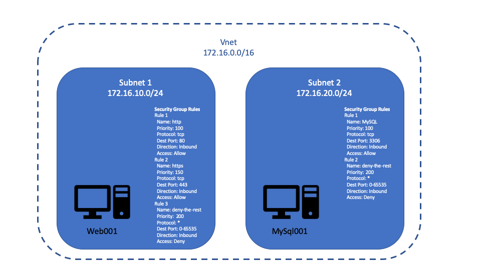

# Terraform Lab 5 - Reusability

In this section you will:

- create a Terraform module
- use the module in a configuration
- get an introduction to local variables (locals)
- Introduce you to outputs

## Create a Module

In this section you will create a [Teraform module](https://www.terraform.io/docs/modules/index.html) from the configuraiton that you have been working on in previous labs. Modules are a way to package up a configuration for easy reuse. The result will be a module that can be used to create a VM with an associated subnet and a relavant security group with appropriate rules. It also allows including business best practices, defaults, etc. A module typically consists of the following:

- [Input variables]() to accept values from the calling module/configuration.
- [Output values]() to return results to the calling module, which it can then use to populate arguments elsewhere.
- [Resources]() to define one or more infrastructure objects that the module will manage.

Modules can be stored and shared using any of the follwing [sources](https://www.terraform.io/docs/modules/sources.html):
- Local paths
- Terraform Registry
- GitHub
- Bitbucket
- Generic Git, Mercurial repositories
- Http Urls
- S3 buckets
- Gcs Buckets

In this lab we will be using the local path source so lets get started creating and populating the local module path...

### Create and populate local module

To follow best practices, start by creating a folder named **modules** in the folder where your existing Terraform configuration exists. Then create a folder named **azvm** under your new modules folder. This is the folder where we will create / move all of the module code. 

Now that you have the location for the module move the following files form the root to this new folder:

- nic.tf
- variables.tf
- vm.tf

Next create the following new files:

In the module folder

- subnet.tf: You will move the subnet related code here from the vnet.tf file.
- outputs.tf: This file will be use to define the values that we want to return from the module. Like values returned form resources, these values can be used as input, etc. in your configuration.
- readme.md: This file is used to describe the module. It is not required by is a best practices so that consumers of the module can understand how to use the module.

In the root folder

- main.tf: Raname the vnet.tf file main.tf. This will be the file that is used to reference your module. 

Now you should have a folder structure that resembles the following:

```
-- root folder
  |
  -- modules
    |
    -- azvm
      |
      -- nic.tf
      -- outputs.tf
      -- readme.md
      -- subnet.tf
      -- variables.tf
      -- vm.tf
  -- providers.tf
  -- main.tf
  -- terraform.tfvars
  -- vnet.tf
```

With the folder structure in tact, we will now make some changes to the existing files and add the appropriate code to the new files. Start by moving the `azurerm_subnet`, `azurerm_network_security_group` and `azurerm_subnet_network_security_group_association` resources from the vnet.tf to the subnet.tf file.

Now, add the following variables of type string to your variables.tf file:
- vnet_name
- subnet_cidr
- host_name

In order to make the code that you wrote previously reusable, you need to ensure that all of the names of Azure resources are unique. This will allow the module to be used to create multiple instances of the included resources. Make the following changes in your module files:

*nic.tf*

1. Ensure the name of the nic is unique so use string concatination to append the host name to it. The name property of your `azurerm_network_interface` should now be something like "**tfignitepredaynic-${var.host_name}**".

*vm.tf*

1. Update the name value for `azurerm_virtual_machine` to reference the new variable that you created in your variables.tf file named "**host_name**".
1. Ensure that the name of your storage disk is unique by appending the host name to it. The name property for the `storage_os_disk` should now be something like "**myosdisk1-${var.host_name}**".
1. Instead of leaving the hard coded host name in the `os_profile` block, replace it with the new variable "**host_name**".

*subnet.tf*

1. This module will be used to creat any number of subnets with associated security groups and rules so delete the second subnet named **predaywebsubnet**.
1. Since the subnet may contain a number of VMs for a given role, you are going to get a little fancy and use another function to generalize the subnet name. You will use the [regex](https://www.terraform.io/docs/configuration/functions/regex.html) function to take the prefix of the hostname. Replace the value of the name property of the `azurerm_subnet` resource with `regex("^[[:alpha:]]+", var.host_name)`.
1. As you will see in the next section, you will be defining the virtual network outside of the module and passing the name in as a variable to the module so replace the virtual_network_name property value with the variable **var.vnet_name**.
1. Since each of the subnets will be part of the same virtual network, you need to ensure that the subnet ip ranges do not overlab so change the *address_prefix* property to **var.subnet_cidr** in order to accept a unique value.
1. Make sure that the subnet will be associated with the security group by adding the `network_secuirty_group_id` if it does not already exist. The value should be the same as it was in the previous lab **azurerm_network_security_group.predaysg.id**
1. Ensure that the name of your security group is unique by appending the host name to it. The name properyt for the `azurerm_network_security_group` should now be something like "**rules-${var.host_name}**".
1. Make sure that the values in the `azurerm_subnet_network_security_group_association` resource have the correct resource names:
    - azurerm_subnet.predaysubnet.id
    - azurerm_network_security_group.predaysg.id

Finally, you may need to use values from some of the resources created in this module as input to other resources or modules. To expose these, you add them as output values. By convention, this is typically done in an outputs.tf file like the one that you created earlier so lets update that file to make the virtual machine id, mac address and private ip address availble. Create output variables for **vm_id**, **mac_address**, **private_ip** in the following format in your output.tf file:


```terraform
output "<<<Name of value to output>>>" {
  value = <<<Reference to value>>>
}

```
Congratulations on creating your first Terraform module! The module is ready to be used by your higher level configuration.

#### CHEAT SHEETS

<details>
<summary>
Expand for full nic.tf code
</summary>

```terraform
# Configure Network Interface
resource "azurerm_network_interface" "predaynic" {
  name                = "tfignitepredaynic-${var.host_name}"
  location            = var.location
  resource_group_name = var.rg

  ip_configuration {
    name                          = "tfpredaynicconfig"
    subnet_id                     = azurerm_subnet.predaysubnet.id
    private_ip_address_allocation = "Dynamic"
  }
  tags                = var.tags
}
```
</details>

<details>
<summary>
Expand for full ouputs.tf code
</summary>

```terraform
output "vm_id" {
  value = azurerm_virtual_machine.predayvm.id
}

output "mac_address" {
  value = azurerm_network_interface.predaynic.mac_address
}

output "private_ip" {
  value = azurerm_network_interface.predaynic.private_ip_address
}
```
</details>

<details>
<summary>
Expand for full subnet.tf code
</summary>

```terraform
# Configure Subnet
resource "azurerm_subnet" "predaysubnet" {
  name                 = regex("^[[:alpha:]]+", var.host_name)
  resource_group_name  = var.rg
  virtual_network_name = var.vnet_name
  address_prefix       = var.subnet_cidr # Change to variable for module reuse
  network_security_group_id = azurerm_network_security_group.predaysg.id
}

resource "azurerm_network_security_group" "predaysg" {
  name                = "default-rules-${var.host_name}"
  location            = var.location
  resource_group_name = var.rg

  dynamic "security_rule" {
    for_each = var.security_group_rules

    content {
      name                       = lower(security_rule.value.name)
      description                = "Allow inbound traffic for ${security_rule.value.protocol}"
      priority                   = security_rule.value.priority
      direction                  = "Inbound"
      access                     = "Allow"
      protocol                   = title(security_rule.value.protocol)
      source_port_range          = "*"
      destination_port_range     = security_rule.value.destinationPortRange
      source_address_prefix      = "*"
      destination_address_prefix = "VirtualNetwork"
    }
  }
}

resource "azurerm_subnet_network_security_group_association" "preday" {
  subnet_id                 = azurerm_subnet.predaysubnet.id
  network_security_group_id = azurerm_network_security_group.predaysg.id
}
```
</details>

<details>
<summary>
Expand for full variables.tf code
</summary>

```terraform
variable "rg" {
  type        = "string"
  description = "Name of Lab resource group to provision resources to."
}

variable "location" {
  type        = "string"
  description = "Azure region to put resources in"
}

variable "security_group_rules" {
  type        = list(object({
    name                  = string
    priority              = number
    protocol              = string
    destinationPortRange  = string
  }))
  description = "List of security group rules"
}

variable "secret_id" {
  type        = "string"
  description = "name of secret containing admin password for vms"
}

variable "key_vault" {
  type        = "string"
  description = "Name of the pre-existing key vault instance"
}

variable "tags" {
  type        = map(string)
  description = "tags to be used with all resources in the lab"
}

variable "vnet_name" {
  type        = string
  description = "Azure ID for Virtual Network where subnets will be placed"
}

variable "subnet_cidr" {
  type        = string
  description = "Subnet in CIDR format"
}

variable "host_name" {
  type        = string
  description = "Unique name for VM"
}
```
</details>

<details>
<summary>
Expand for full vm.tf code
</summary>

```terraform
# Data source reference to key vault instance
data "azurerm_key_vault" "tf_pre-day" {
  name                = var.key_vault
  resource_group_name = var.rg
}

# Data source reference to the secret
data "azurerm_key_vault_secret" "tf_pre-day" {
  name         = var.secret_id
  key_vault_id = data.azurerm_key_vault.tf_pre-day.id
}

# Configure Virtual Machine
resource "azurerm_virtual_machine" "predayvm" {
  name                  = var.host_name
  location              = var.location
  resource_group_name   = var.rg
  vm_size               = "Standard_B1s"
  network_interface_ids = [azurerm_network_interface.predaynic.id]

  storage_image_reference {
    publisher = "Canonical"
    offer     = "UbuntuServer"
    sku       = "16.04-LTS"
    version   = "latest"
  }

  storage_os_disk {
    name              = "myosdisk1-${var.host_name}"
    caching           = "ReadWrite"
    create_option     = "FromImage"
    managed_disk_type = "Standard_LRS"
  }

  os_profile {
    computer_name  = var.host_name
    admin_username = "testadmin"
    admin_password = data.azurerm_key_vault_secret.tf_pre-day.value
  }

  os_profile_linux_config {
    disable_password_authentication = false
  }

  tags                = var.tags
}
```
</details>


## Use the Module

In this section you will be work in the main.tf file. You use the module that you created in the previous section to provision a virtual network with two subnets containing a single virtual machine each. 


For more information about module syntax in your configurations refer to [Terraform modules in configurations](https://www.terraform.io/docs/configuration/modules.html)

In the main.tf file you will you will be defining all of the values that are required by the module and the resources, hence no need for the *terraform.tfvars* file. You will deleted this file after completing the main.tf file. 

To reduce the number of times that you will need to type values, you will make use of a Terraform concept that has not been introduced yet: [Local Variables](https://www.terraform.io/docs/configuration/locals.html). At the top of your main.tf file create a locals block and move the following variables and associated values from the `terraform.tfvars` file:

- location
- rg
- key_vault
- rg2
- tags

To reference these values in the configuration replace the **var.** that was used to reference the variables with **local.**. Update the references in the `azurerm_virtual_network` resource for location, tags and rg to use the locals instead of variables.

Lastly, use the module to add the subnet with associated security group rules and vm. The syntax for referring to a module is very similar to that of a resource with the a few exceptions.

1. Use the `module` keyword instead of `resource`.
1. You do not refer to a module type in the block, you just give it a name.
1. You **must* specify the source property in the module block. The value of this is the module name and location. Since you are using a local path, you will use the following:

    ```terraform
    source              = "./modules/azvm"
    ```

The properties that you will use in the module are the variables that you defined in your variables.tf file. Specifcally:

- host_name
- rg
- location
- secret_id
- rg2
- key_vault
- vnet_name
- subnet_cidr
- security_group_rules
- tags

Use the figure above and the local variables to set the appropriate values for each module.

Remove the terraform.tfvars file.

> **NOTE** Using VS code to push your files to cloud shell will update existing files and add new files but will not delete existing files that are no longer used so you will need to clean up the following files from cloud shell before running terraform plan or apply:
> - nic.tf
> - terraform.tfvars
> - variables.tf
> - nic.tf

Finally, as you have done in previous sections and labs:
- Povision the new infrasctructure using Terraform init, plan and apply
- Validate that everything was provisioned as expected.

Congratulations, you have created a module and used it to provision new infrastructure!

#### CHEAT SHEETS

<details>
<summary>
Expand for full main.tf code
</summary>

```terraform
# Define local variable for use in resources and modules
locals {
  location          = "East US 2"
  rg                = "" ## Enter the resource group pre-created in your lab
  key_vault          = "" ## Enter the name of the pre-created key vault instance
  tags = {
    event           = "Ignite"
    year            = "2019"
    session_id      = "PRE04"
    iac_tool        = "terraform"
    lab             = "5"
  }
}

# Configure Vnet
resource "azurerm_virtual_network" "predayvnet" {
  name                = "tfignitepreday"
  location            = local.location
  resource_group_name = local.rg
  address_space       = ["172.16.0.0/16"]
  tags                = local.tags
}

module "frontend" {
  source              = "./modules/azvm"

  host_name           = "web001"
  rg                  = local.rg
  location            = local.location
  secret_id            = "lab04admin"
  key_vault            = local.key_vault
  vnet_name           = azurerm_virtual_network.predayvnet.name
  subnet_cidr         = "172.16.10.0/24"
  security_group_rules  = [
      {
          name                  = "HTTP"
          priority              = 100
          protocol              = "tcp"
          destinationPortRange  = "80"
      },
      {
          name = "SSH"
          priority              = 150
          protocol              = "tcp"
          destinationPortRange  = "22"
      }
  ]

  tags                = local.tags
}

module "mysql_db" {
  source = "./modules/azvm"
  
  host_name           = "mysql001"
  rg                  = local.rg
  location            = local.location
  secret_id            = "lab04admin"
  key_vault            = local.key_vault
  vnet_name           = azurerm_virtual_network.predayvnet.name
  subnet_cidr         = "172.16.20.0/24"
  security_group_rules  = [
      {
          name                  = "SQL"
          priority              = 100
          protocol              = "tcp"
          destinationPortRange  = "3306"
      },
  ]

  tags = local.tags
}
```
</details>


